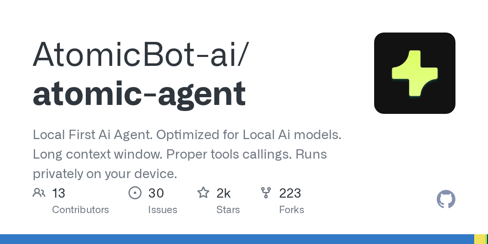

# AtomicBot-ai/atomic-agent

**⭐ 2 419** · **язык: TypeScript** · **forks: 223** · **license: MIT**

> AI · известность · активный push

## Суть

Local First Ai Agent. Optimized for Local Ai models. Long context window. Proper tools callings. Runs privately on your device.

## Почему в ленте

- ветка: `imba/ai` (AI)
- score: `116.3`
- источник: `search:tools`
- топики: `agents`, `ai-agent`, `browser-automation`, `cli`, `gguf`, `hermes-agent`, `llama-cpp`, `llm`

## Из README

  Drives your browser, edits files, runs approved commands, and remembers context across sessions. Open source, running on our TurboQuant `llama.cpp` for +30-50% throughput on small local models. **[Quick Install](#quick-install) · [Benchma…

## Ссылки

[Репозиторий](https://github.com/AtomicBot-ai/atomic-agent) · [сайт](https://atomicagent.io)

---
2026-08-20 · imba-radar
