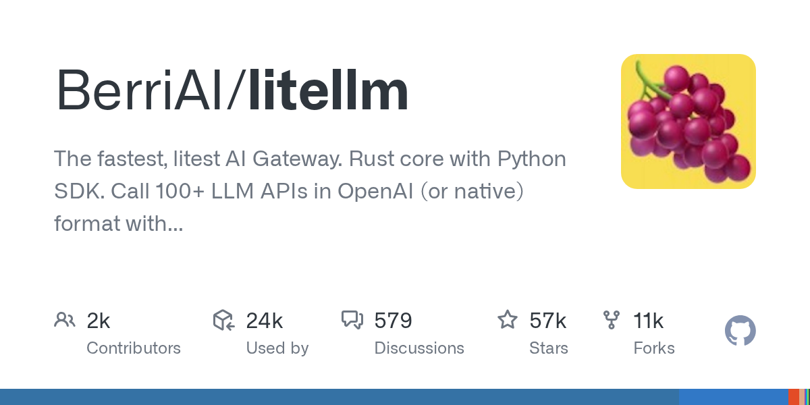

# BerriAI/litellm

**⭐ 56 769** · **язык: Python** · **forks: 10 729** · **license: NOASSERTION**

> AI · известность · активный push

## Суть

The fastest, litest AI Gateway. Rust core with Python SDK. Call 100+ LLM APIs in OpenAI (or native) format with cost tracking, guardrails, load balancing, and logging [Bedrock, Azure, OpenAI, Anthropic, OpenAI, VertexAI, vLLM, Nvidia NIM]

## Почему в ленте

- ветка: `imba/ai` (AI)
- score: `140.6`
- источник: `search:ai`
- топики: `ai-gateway`, `anthropic`, `azure-openai`, `bedrock`, `gateway`, `langchain`, `litellm`, `llm`

## Из README

<h1 align="center"> 🚅 LiteLLM </h1> 
 
LiteLLM AI Gateway 
 
Open Source AI Gateway for 100+ LLMs. Self-hosted. Enterprise-ready. Call any LLM in OpenAI format.
 
 <a href="https://render.com/deploy?repo=https://github.com/BerriAI/litellm" target…

## Ссылки

[Репозиторий](https://github.com/BerriAI/litellm) · [сайт](https://docs.litellm.ai/docs/)

---
2026-08-20 · imba-radar
