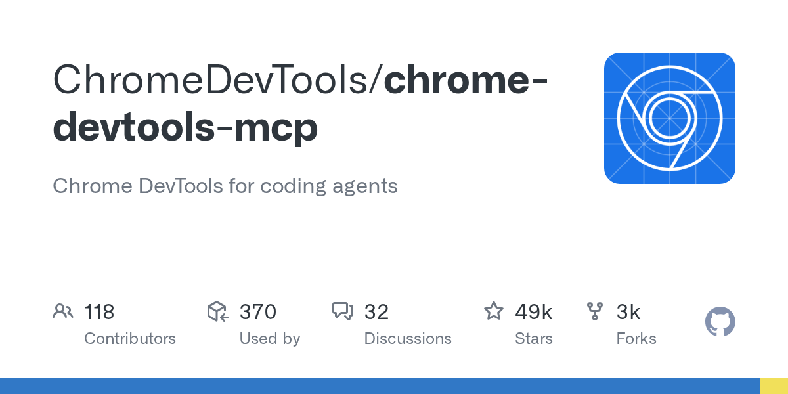

# ChromeDevTools/chrome-devtools-mcp

**⭐ 49 424** · **язык: TypeScript** · **forks: 3 449** · **license: Apache-2.0**

> AI · известность · активный push

## Суть

Chrome DevTools for coding agents

## Почему в ленте

- ветка: `imba/ai` (AI)
- score: `144.6`
- источник: `trending:typescript`
- топики: `browser`, `chrome`, `chrome-devtools`, `debugging`, `devtools`, `mcp`, `mcp-server`, `puppeteer`

## Из README

Chrome DevTools for agents (`chrome-devtools-mcp`) lets your coding agent (such as Antigravity, Claude, Cursor or Copilot) control and inspect a live Chrome browser. It acts as a Model-Context-Protocol (MCP) server, giving your AI coding assistant access to the full power of Chrome DevTools for reliable automation, in-…

## Ссылки

[Репозиторий](https://github.com/ChromeDevTools/chrome-devtools-mcp) · [сайт](https://npmjs.org/package/chrome-devtools-mcp)

---
2026-08-20 · imba-radar
