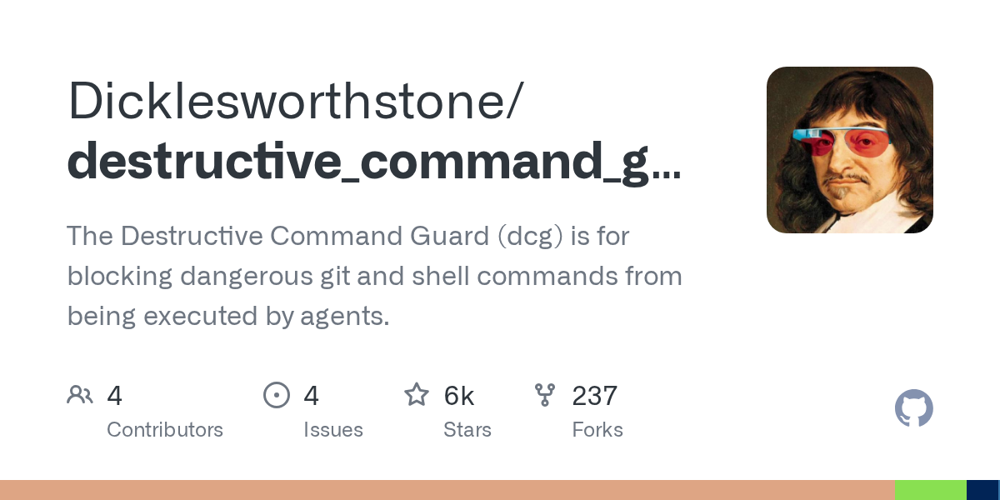

# Dicklesworthstone/destructive_command_guard

**⭐ 5 791** · **язык: Rust** · **forks: 237** · **license: NOASSERTION**

> Tools · известность · активный push

## Суть

The Destructive Command Guard (dcg) is for blocking dangerous git and shell commands from being executed by agents.

## Почему в ленте

- ветка: `imba/tools` (Tools)
- score: `137.6`
- источник: `search:tools`
- топики: `ai-agents`, `cli`, `developer-tools`, `git`, `rust`, `safety`

## Из README

  
 
 
 A high-performance hook for AI coding agents that blocks destructive commands before they execute, protecting your work from accidental deletion across…

## Ссылки

[Репозиторий](https://github.com/Dicklesworthstone/destructive_command_guard)

---
2026-08-20 · imba-radar
