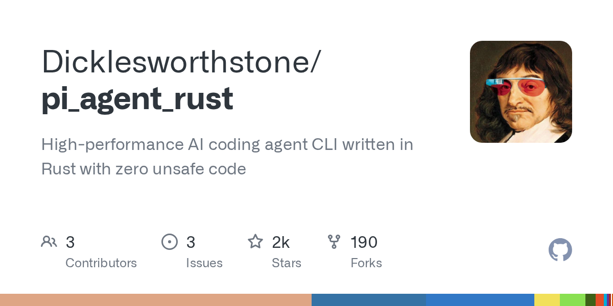

# Dicklesworthstone/pi_agent_rust

**⭐ 1 622** · **язык: Rust** · **forks: 190** · **license: NOASSERTION**

> Tools · известность · активный push

## Суть

High-performance AI coding agent CLI written in Rust with zero unsafe code

## Почему в ленте

- ветка: `imba/tools` (Tools)
- score: `96.0`
- источник: `search:tools`
- топики: `ai-agents`, `cli`, `developer-tools`, `rust`

## Из README

  
 <h1 align="center">pi_agent_rust</h1> 
 <strong>pi_agent_rust - Native AI coding agent CLI written in Rust</strong> 
 
 <a href="#why-should-you-care">Why Should You Care?</a> •

## Ссылки

[Репозиторий](https://github.com/Dicklesworthstone/pi_agent_rust)

---
2026-08-20 · imba-radar
