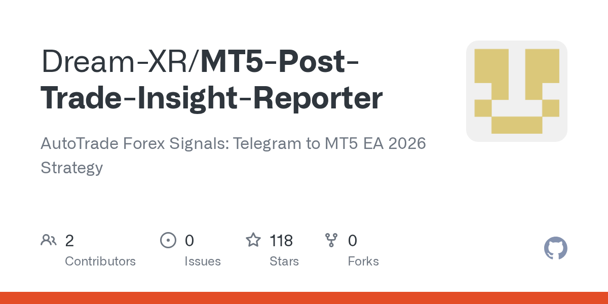

# Dream-XR/MT5-Post-Trade-Insight-Reporter

**⭐ 118** · **язык: HTML** · **forks: 0** · **license: n/a**

> Bots · известность · активный push

## Суть

AutoTrade Forex Signals: Telegram to MT5 EA 2026 Strategy

## Почему в ленте

- ветка: `imba/bots` (Bots)
- score: `54.8`
- источник: `search:bots`
- топики: `automated-trading`, `copy-trading`, `expert-advisor`, `forex-trading`, `metatrader`, `metatrader5`, `mql4`, `mql5`

## Из README

**An event-driven, multi-asset trading automation engine designed for retail traders who demand institutional-grade order management without the broker lock-in.**   **Strategy Orchestrator** is a comprehensive trading infrastructure that decouples signal generation from execution. While many platforms force you into…

## Ссылки

[Репозиторий](https://github.com/Dream-XR/MT5-Post-Trade-Insight-Reporter)

---
2026-08-20 · imba-radar
