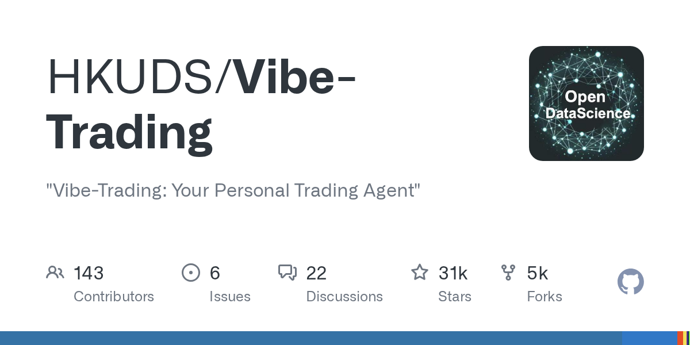

# HKUDS/Vibe-Trading

**⭐ 31 289** · **язык: Python** · **forks: 5 078** · **license: MIT**

> AI · известность · активный push

## Суть

"Vibe-Trading: Your Personal Trading Agent"

## Почему в ленте

- ветка: `imba/ai` (AI)
- score: `144.6`
- источник: `search:ai`
- топики: `ai-agent`, `algorithmic-trading`, `backtesting`, `fintech`, `llm`, `mcp`, `multi-agent`, `python`

## Из README

 <b>English</b> | <a href="README_zh.md">中文</a> | <a href="README_ja.md">日本語</a> | <a href="README_ko.md">한국어</a> | <a href="README_ar.md">العربية</a> | <a href="README_es.md">Español</a> 
 
 

## Ссылки

[Репозиторий](https://github.com/HKUDS/Vibe-Trading) · [сайт](https://vibetrading.wiki/)

---
2026-08-20 · imba-radar
