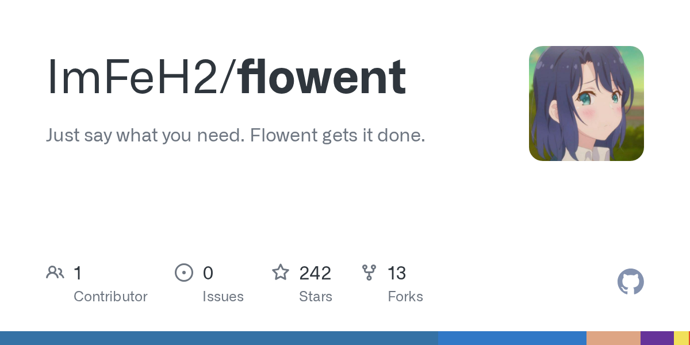

# ImFeH2/flowent

**⭐ 242** · **язык: Python** · **forks: 13** · **license: Apache-2.0**

> AI · известность · активный push

## Суть

Just say what you need. Flowent gets it done.

## Почему в ленте

- ветка: `imba/ai` (AI)
- score: `66.0`
- источник: `search:bots`
- топики: `agent`, `agent-runtime`, `agentic-workflows`, `ai`, `ai-agent`, `ai-workspace`, `automation`, `fastapi`

## Из README

  
 Just say what you need. Flowent gets it done.

## Ссылки

[Репозиторий](https://github.com/ImFeH2/flowent)

---
2026-08-20 · imba-radar
