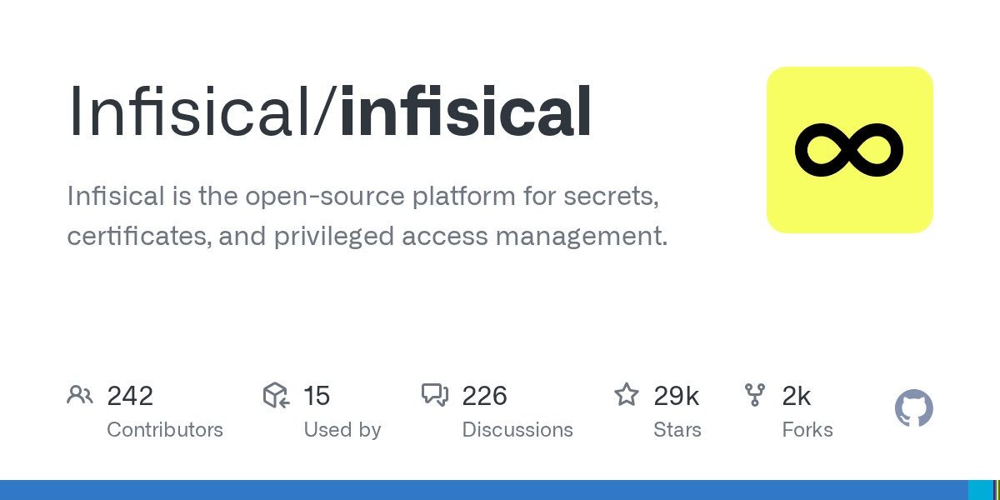

# Infisical/infisical

**⭐ 28 854** · **язык: TypeScript** · **forks: 2 209** · **license: NOASSERTION**

> Tools · известность · активный push

## Суть

Infisical is the open-source platform for secrets, certificates, and privileged access management.

## Почему в ленте

- ветка: `imba/tools` (Tools)
- score: `140.6`
- источник: `search:tools`
- топики: `acme`, `certificate-management`, `cli`, `environment-variables`, `go`, `golang`, `node-js`, `open-source`

## Из README

<h1 align="center"> <picture> <source media="(prefers-color-scheme: dark)" srcset="/img/logoname-white.svg">  </picture> </h1> 
 
<b>The open-source secret management platform</b>: Sync secrets/configs across your team/infr…

## Ссылки

[Репозиторий](https://github.com/Infisical/infisical) · [сайт](https://infisical.com)

---
2026-08-20 · imba-radar
