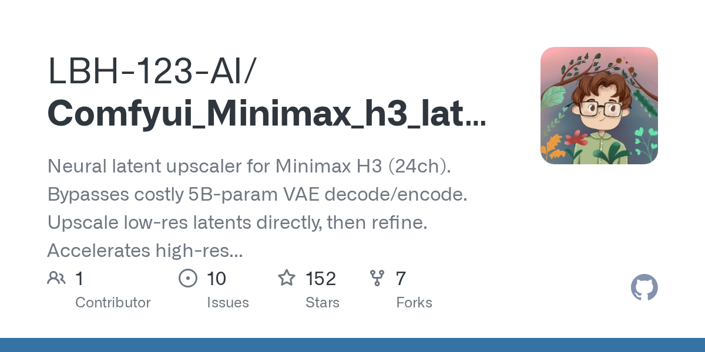

# LBH-123-AI/Comfyui_Minimax_h3_latent_Upscaler

**⭐ 152** · **язык: Python** · **forks: 7** · **license: n/a**

> New · известность · свежий репо · активный push

## Суть

Neural latent upscaler for Minimax H3 (24ch). Bypasses costly 5B-param VAE decode/encode. Upscale low-res latents directly, then refine. Accelerates high-res video gen, outperforms naive interp.

## Почему в ленте

- ветка: `imba/new` (New)
- score: `79.1`
- источник: `search:hot`
- топики: _нет_

## Из README

 <a href="./README.md"><strong>English</strong></a> · <a href="./README_zh.md">中文</a> 
 
 **Neural Latent Upscaler for Minimax H3 Video Generation** Learned · High-fidelity · 2D & 3D Variants 
 - [2026-08-19] 🚀 **3D node overhaul**: all three resize modes (`scale by multipli…

## Ссылки

[Репозиторий](https://github.com/LBH-123-AI/Comfyui_Minimax_h3_latent_Upscaler)

---
2026-08-20 · imba-radar
