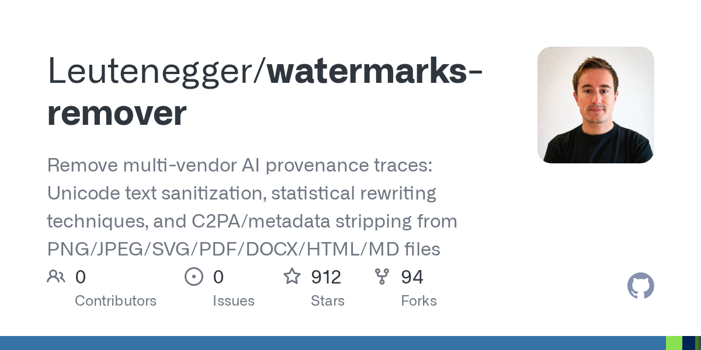

# Leutenegger/watermarks-remover

**⭐ 912** · **язык: Python** · **forks: 94** · **license: MIT**

> Tools · известность · свежий репо · активный push

## Суть

Remove multi-vendor AI provenance traces: Unicode text sanitization, statistical rewriting techniques, and C2PA/metadata stripping from PNG/JPEG/SVG/PDF/DOCX/HTML/MD files

## Почему в ленте

- ветка: `imba/tools` (Tools)
- score: `109.3`
- источник: `search:hot`
- топики: `claude`, `claude-code`, `claude-skills`, `codex`, `codex-cli`, `codex-desktop`, `codex-plugin`, `codex-skill`

## Ссылки

[Репозиторий](https://github.com/Leutenegger/watermarks-remover)

---
2026-08-20 · imba-radar
