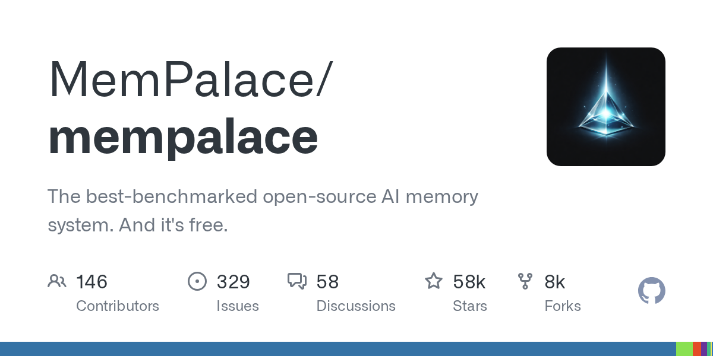

# MemPalace/mempalace

**⭐ 58 474** · **язык: Python** · **forks: 7 502** · **license: MIT**

> AI · известность · активный push

## Суть

The best-benchmarked open-source AI memory system. And it's free.

## Почему в ленте

- ветка: `imba/ai` (AI)
- score: `144.6`
- источник: `search:ai`
- топики: `ai`, `chromadb`, `llm`, `mcp`, `memory`, `python`

## Из README

  Local-first AI memory. Verbatim storage, pluggable backend, 96.6% R@5 raw on LongMemEval — zero API calls. 
 > [!CAUTION] > **Beware of impostor sites.** MemPalace has no other official websites. The **only** official sources ar…

## Ссылки

[Репозиторий](https://github.com/MemPalace/mempalace) · [сайт](http://mempalaceofficial.com/)

---
2026-08-20 · imba-radar
