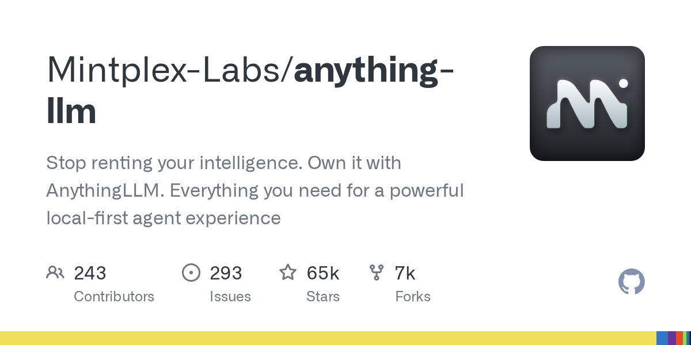

# Mintplex-Labs/anything-llm

**⭐ 64 933** · **язык: JavaScript** · **forks: 7 157** · **license: MIT**

> AI · известность · активный push

## Суть

Stop renting your intelligence. Own it with AnythingLLM. Everything you need for a powerful local-first agent experience

## Почему в ленте

- ветка: `imba/ai` (AI)
- score: `144.6`
- источник: `search:ai`
- топики: `agent-computer`, `agent-harness`, `agent-orchestration`, `agentic-ai`, `ai-agents`, `computer-use`, `hermes-agent`, `llm`

## Из README

 > [!NOTE] > We are also working on [Open Computer](/open-computer) which gives an entire computer environment for AI Agents to use. > > This will bring AnythingLLM's agent capabilities to a new level and a novel UX paradigm for AI Agent use. > > ⭐ Star the repo to stay updated!

## Ссылки

[Репозиторий](https://github.com/Mintplex-Labs/anything-llm) · [сайт](https://anythingllm.com)

---
2026-08-20 · imba-radar
