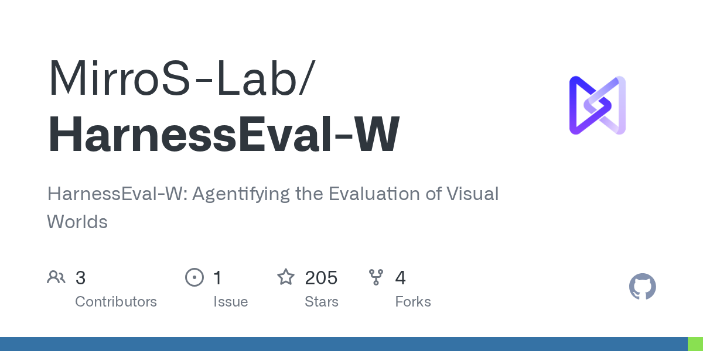

# MirroS-Lab/HarnessEval-W

**⭐ 205** · **язык: Python** · **forks: 4** · **license: n/a**

> AI · известность · свежий репо

## Суть

HarnessEval-W: Agentifying the Evaluation of Visual Worlds

## Почему в ленте

- ветка: `imba/ai` (AI)
- score: `81.1`
- источник: `search:hot`
- топики: `agent`, `benchmark`, `evaluation`, `harness`, `harness-engineering`, `kling`, `minimax-h3`, `seedance`

## Из README

  
 <h1 align="center">HarnessEval-W</h1> 
 <b>Agentifying the Evaluation of Visual Worlds</b> 
 
 <i>The era of harnessed benchmarking: evaluation defines the taste of evolution.</i>

## Ссылки

[Репозиторий](https://github.com/MirroS-Lab/HarnessEval-W) · [сайт](https://mirros-lab.github.io/HarnessEval-W/)

---
2026-08-20 · imba-radar
