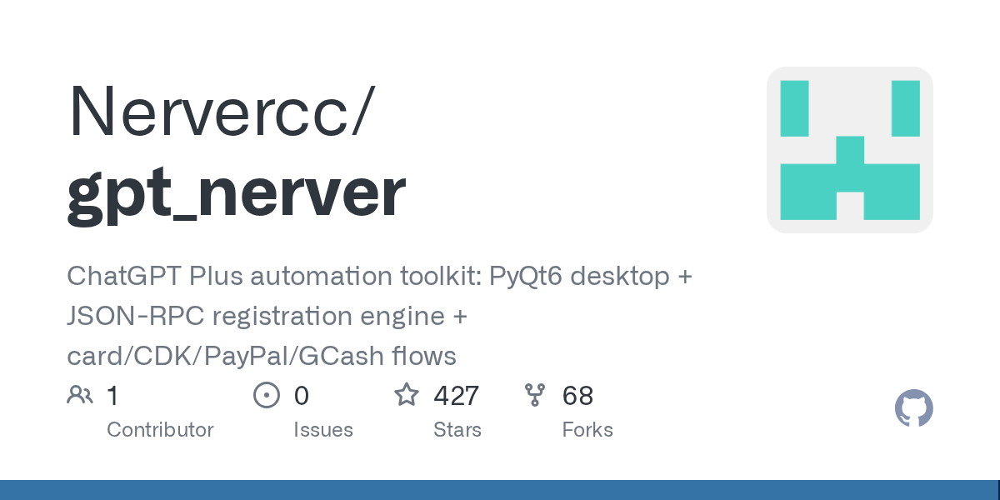

# Nervercc/gpt_nerver

**⭐ 427** · **язык: Python** · **forks: 68** · **license: MIT**

> Tools · известность

## Суть

ChatGPT Plus automation toolkit: PyQt6 desktop + JSON-RPC registration engine + card/CDK/PayPal/GCash flows

## Почему в ленте

- ветка: `imba/tools` (Tools)
- score: `71.6`
- источник: `search:hot`
- топики: _нет_

## Из README

一个用于**批量维护 / 开通 ChatGPT Plus** 的本地 PyQt6 桌面工具。核心能力： - **注册引擎**：协议 / UI 双模式建号（`vendor/register-protocol`），支持 iCloud/Outlook/xpgmail/CF-Worker 邮箱源、密码 + TOTP + Passkey MFA、手机号注册。 - **登录态维护**：session cookie 刷 AT、AT 吊销自动密码 + TOTP 重登、代理体检 + SID 轮换。 - **卡池 & 开通**：Duola 虚拟卡自动开卡 / 补卡；PH-Link 提链 + Stripe 绑卡 + `checkout/confirm`…

## Ссылки

[Репозиторий](https://github.com/Nervercc/gpt_nerver)

---
2026-08-20 · imba-radar
