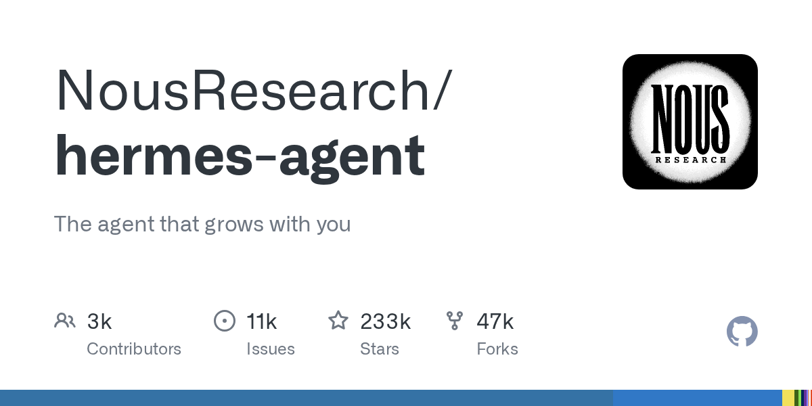

# NousResearch/hermes-agent

**⭐ 233 054** · **язык: Python** · **forks: 46 625** · **license: MIT**

> AI · известность · активный push

## Суть

The agent that grows with you

## Почему в ленте

- ветка: `imba/ai` (AI)
- score: `144.6`
- источник: `search:ai`
- топики: `ai`, `ai-agent`, `ai-agents`, `anthropic`, `chatgpt`, `claude`, `claude-code`, `codex`

## Из README

  
 
 <a href="https://hermes-agent.nousresearch.com/">Hermes Agent</a> | <a href="https://hermes-agent.nousresearch.com/">Hermes Desktop</a> 
 
 <a href="https://hermes-agent.nousresearch.com/docs/"><…

## Ссылки

[Репозиторий](https://github.com/NousResearch/hermes-agent) · [сайт](https://hermes-agent.nousresearch.com)

---
2026-08-20 · imba-radar
