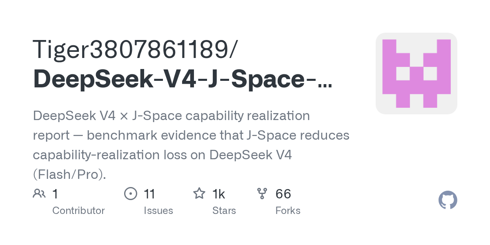

# Tiger3807861189/DeepSeek-V4-J-Space-Capability-Realization-Report

**⭐ 1 018** · **язык: n/a** · **forks: 66** · **license: NOASSERTION**

> AI · известность · активный push

## Суть

DeepSeek V4 × J-Space capability realization report — benchmark evidence that J-Space reduces capability-realization loss on DeepSeek V4 (Flash/Pro).

## Почему в ленте

- ветка: `imba/ai` (AI)
- score: `99.6`
- источник: `search:hot`
- топики: `agent-skills`, `ai-agent`, `benchmark`, `deepseek`, `deepseek-harness`, `dsh`, `dsh-plugin`

## Из README

> **© 2026 Tiger3807861189.** This work is licensed under the [Creative Commons Attribution-NoDerivatives 4.0 International License](https://creativecommons.org/licenses/by-nd/4.0/) (CC BY-ND 4.0). > > **© 2026 Tiger3807861189.** 本记录采用 [知识共享-署名-禁止演绎 4.0 国际许可协议](https://creativecommons.org/licenses/by-nd/4.0/)（CC BY-ND…

## Ссылки

[Репозиторий](https://github.com/Tiger3807861189/DeepSeek-V4-J-Space-Capability-Realization-Report)

---
2026-08-20 · imba-radar
