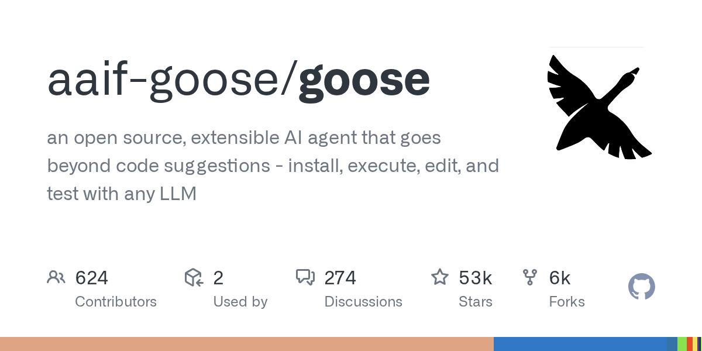

# aaif-goose/goose

**⭐ 53 013** · **язык: Rust** · **forks: 6 041** · **license: Apache-2.0**

> AI · известность · активный push

## Суть

an open source, extensible AI agent that goes beyond code suggestions - install, execute, edit, and test with any LLM

## Почему в ленте

- ветка: `imba/ai` (AI)
- score: `143.4`
- источник: `search:ai`
- топики: `acp`, `ai`, `ai-agents`, `mcp`

## Из README

 _your native open source AI agent — desktop app, CLI, and API — for code, workflows, and everything in between_ 
  <a href="https://discord.gg/n8R5VaWDAn"

## Ссылки

[Репозиторий](https://github.com/aaif-goose/goose) · [сайт](https://goose-docs.ai/)

---
2026-08-20 · imba-radar
