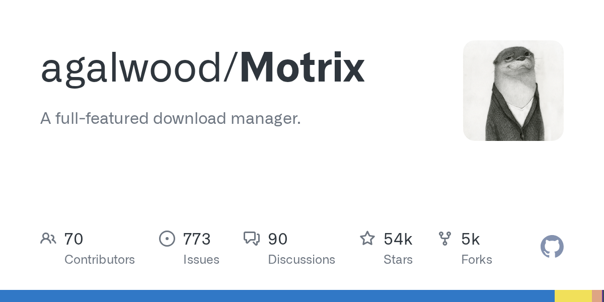

# agalwood/Motrix

**⭐ 54 021** · **язык: TypeScript** · **forks: 4 963** · **license: NOASSERTION**

> Hot · известность · активный push

## Суть

A full-featured download manager.

## Почему в ленте

- ветка: `imba/hot` (Hot)
- score: `140.6`
- источник: `trending:typescript`
- топики: `aria2`, `bittorrent`, `bt`, `download`, `download-manager`, `electron`, `linux`, `mac`

## Из README

  <h1>Motrix</h1> 
A modern, full-featured download manager that stays simple to use
 
 English | [简体中文](./README.zh-CN.md) Motrix is a clean, full-featured desktop download manager for HTTP, FTP, BitTorrent, magnet links, and more.

## Ссылки

[Репозиторий](https://github.com/agalwood/Motrix) · [сайт](https://motrix.app)

---
2026-08-20 · imba-radar
