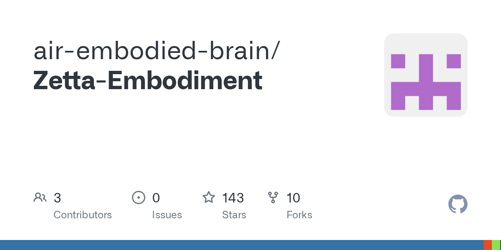

# air-embodied-brain/Zetta-Embodiment

**⭐ 143** · **язык: Python** · **forks: 10** · **license: n/a**

> New · известность · свежий репо · активный push

## Суть

Без описания

## Почему в ленте

- ветка: `imba/new` (New)
- score: `70.5`
- источник: `search:hot`
- топики: _нет_

## Из README

  
 Zetta is an efficient closed-loop embodied harness for self-evolving physical intelligence. It evolves code-based runtime critics and recovery skills online while keeping the base policy frozen, achieving state-of-the-art success on LI…

## Ссылки

[Репозиторий](https://github.com/air-embodied-brain/Zetta-Embodiment)

---
2026-08-20 · imba-radar
