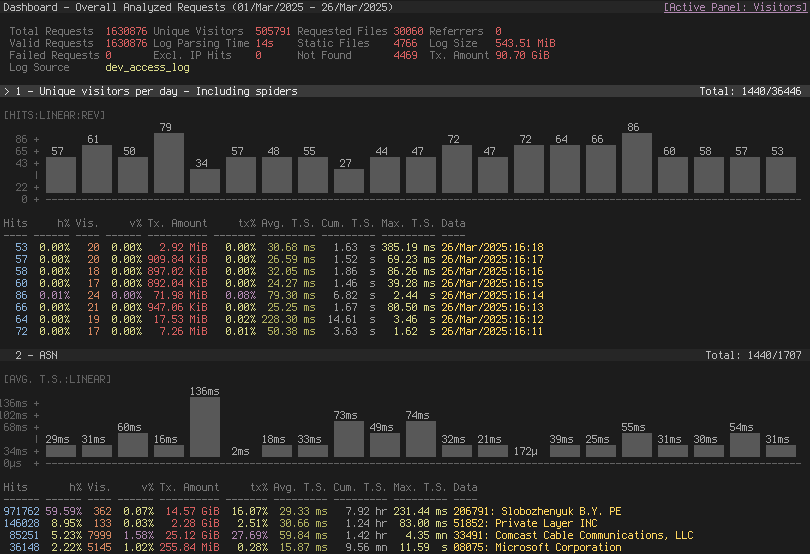

# allinurl/goaccess

**⭐ 20 828** · **язык: C** · **forks: 1 190** · **license: MIT**

> Tools · известность · активный push

## Суть

GoAccess is a real-time web log analyzer and interactive viewer that runs in a terminal in *nix systems or through your browser.

## Почему в ленте

- ветка: `imba/tools` (Tools)
- score: `144.6`
- источник: `search:tools`
- топики: `analytics`, `apache`, `c`, `caddy`, `cli`, `command-line`, `dashboard`, `data-analysis`

## Из README

GoAccess   ======== GoAccess is an open source, real-time web log analyzer and interactive view…

## Ссылки

[Репозиторий](https://github.com/allinurl/goaccess) · [сайт](https://goaccess.io)

---
2026-08-20 · imba-radar
