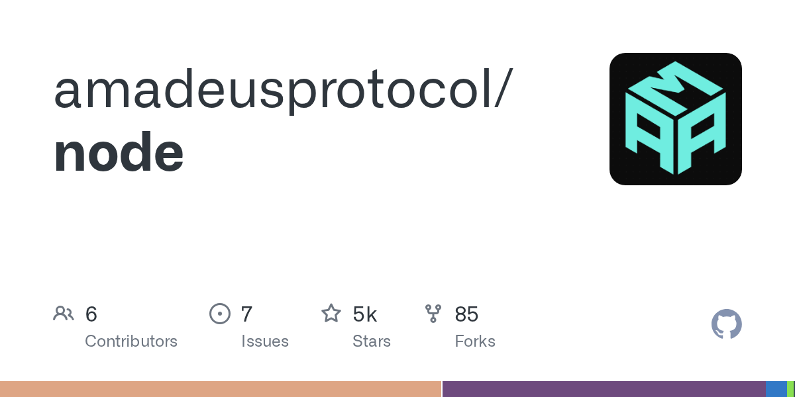

# amadeusprotocol/node

**⭐ 4 554** · **язык: Rust** · **forks: 85** · **license: n/a**

> Hot · известность

## Суть

Без описания

## Почему в ленте

- ветка: `imba/hot` (Hot)
- score: `109.4`
- источник: `trending:all`
- топики: _нет_

## Из README

Linux Kernel 6.8 Ubuntu 24.04 Using podman or docker

## Ссылки

[Репозиторий](https://github.com/amadeusprotocol/node)

---
2026-08-20 · imba-radar
