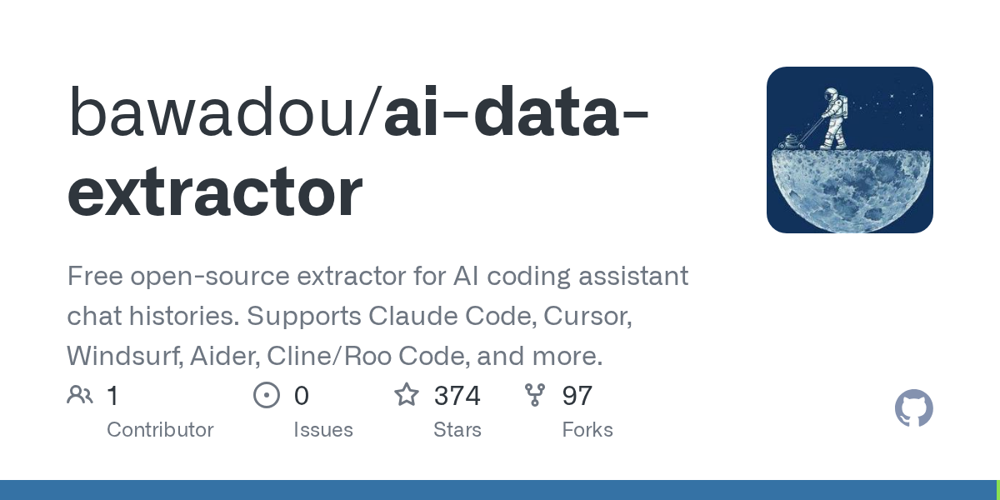

# bawadou/ai-data-extractor

**⭐ 374** · **язык: Python** · **forks: 97** · **license: MIT**

> AI · известность

## Суть

Free open-source extractor for AI coding assistant chat histories. Supports Claude Code, Cursor, Windsurf, Aider, Cline/Roo Code, and more.

## Почему в ленте

- ветка: `imba/ai` (AI)
- score: `75.6`
- источник: `search:hot`
- топики: `ai`, `ai-data-extractor`, `claude`, `cursor`, `cursor-ai`, `data-extraction`, `gemini`

## Из README

Extract your **own local chat history** from AI coding assistants into a single, normalized JSONL format - for fine-tuning, personal analytics, or just backing up years of conversations before an app's local database gets cleared. Auto-discovers and extracts complete conversation history, including:

## Ссылки

[Репозиторий](https://github.com/bawadou/ai-data-extractor)

---
2026-08-20 · imba-radar
