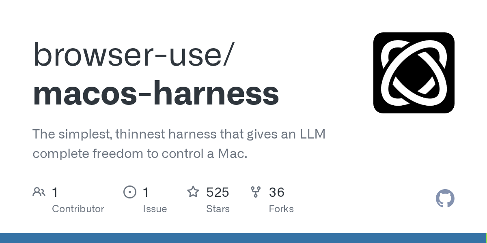

# browser-use/macos-harness

**⭐ 525** · **язык: Python** · **forks: 36** · **license: MIT**

> AI · известность

## Суть

The simplest, thinnest harness that gives an LLM complete freedom to control a Mac.

## Почему в ленте

- ветка: `imba/ai` (AI)
- score: `83.9`
- источник: `search:hot`
- топики: `accessibility`, `agent`, `automation`, `cdp`, `computer-use`, `macos`, `python`

## Из README

 The simplest, thinnest harness that gives an LLM complete freedom to complete virtually any task on a Mac. The agent writes what is missing, mid-task. No framework, no recipes, no rails.

## Ссылки

[Репозиторий](https://github.com/browser-use/macos-harness) · [сайт](https://github.com/browser-use/macos-harness)

---
2026-08-20 · imba-radar
