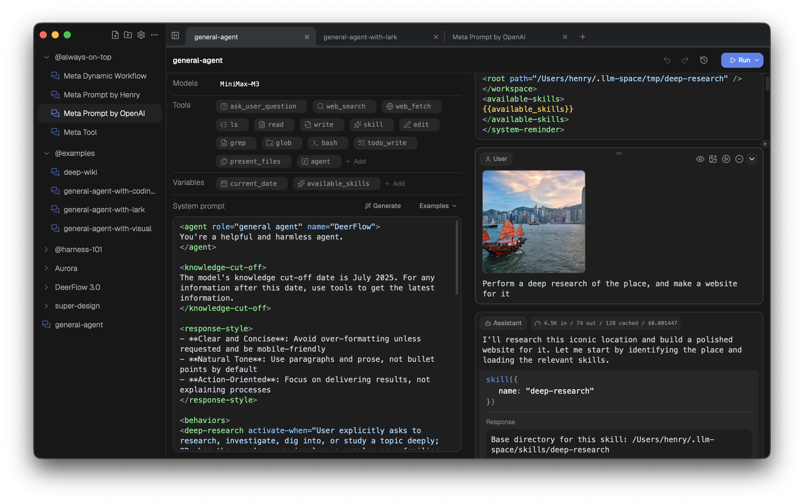

# bytedance/deer-flow

**⭐ 80 339** · **язык: Python** · **forks: 11 016** · **license: MIT**

> AI · известность · активный push

## Суть

An open-source long-horizon SuperAgent harness that researches, codes, and creates. With the help of sandboxes, memories, tools, skill, subagents and message gateway, it handles different levels of tasks that could take minutes to hours.

## Почему в ленте

- ветка: `imba/ai` (AI)
- score: `144.6`
- источник: `search:ai`
- топики: `agent`, `agentic`, `agentic-framework`, `agentic-workflow`, `ai`, `ai-agents`, `deep-research`, `harness`

## Из README

English | [中文](./README_zh.md) | [日本語](./README_ja.md) | [Français](./README_fr.md) | [Русский](./README_ru.md) <a href="https://trendshift.io/repositories/14699" target="_blank">2026-08-20 · imba-radar
