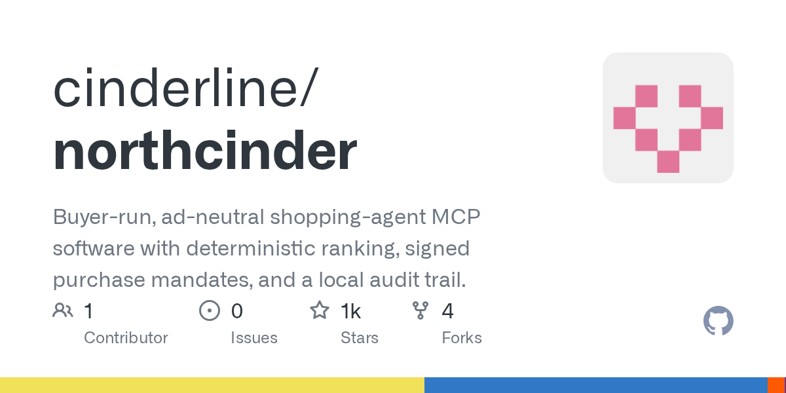

# cinderline/northcinder

**⭐ 1 193** · **язык: JavaScript** · **forks: 4** · **license: MIT**

> AI · известность · свежий репо · активный push

## Суть

Buyer-run, ad-neutral shopping-agent MCP software with deterministic ranking, signed purchase mandates, and a local audit trail.

## Почему в ленте

- ветка: `imba/ai` (AI)
- score: `121.3`
- источник: `search:hot`
- топики: `agentic-commerce`, `human-in-the-loop`, `local-first`, `mcp`, `mcp-server`, `model-context-protocol`, `privacy`, `self-hosted`

## Из README

**Make your shopping agent compare, explain, and ask before buying.** NorthCinder is an open-source MCP server that helps an AI agent compare products against your brief. It returns a ranked shortlist with reasons, reports which stores it could and could not search, and requires a

## Ссылки

[Репозиторий](https://github.com/cinderline/northcinder)

---
2026-08-20 · imba-radar
