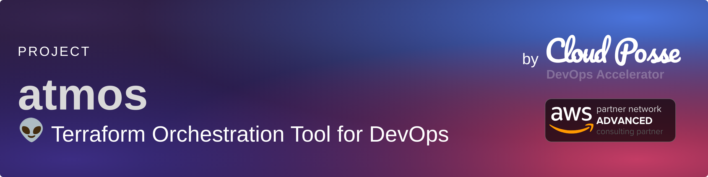

# cloudposse/atmos

**⭐ 1 356** · **язык: Go** · **forks: 173** · **license: Apache-2.0**

> Tools · известность · активный push

## Суть

Atmos is the open-source runtime for infrastructure — it builds, authenticates, and ships Terraform, OpenTofu, Kubernetes, Helm, and containers the same way on your laptop, in CI, and with AI agents.

## Почему в ленте

- ветка: `imba/tools` (Tools)
- score: `99.5`
- источник: `search:tools`
- топики: `automation`, `cli`, `cloud`, `devops`, `hcl2`, `helm`, `helmfile`, `orchestration`

## Из README

<!-- markdownlint-disable -->   
 <a href="https://github.com/cloudposse/atmos/releases/latest">2026-08-20 · imba-radar
