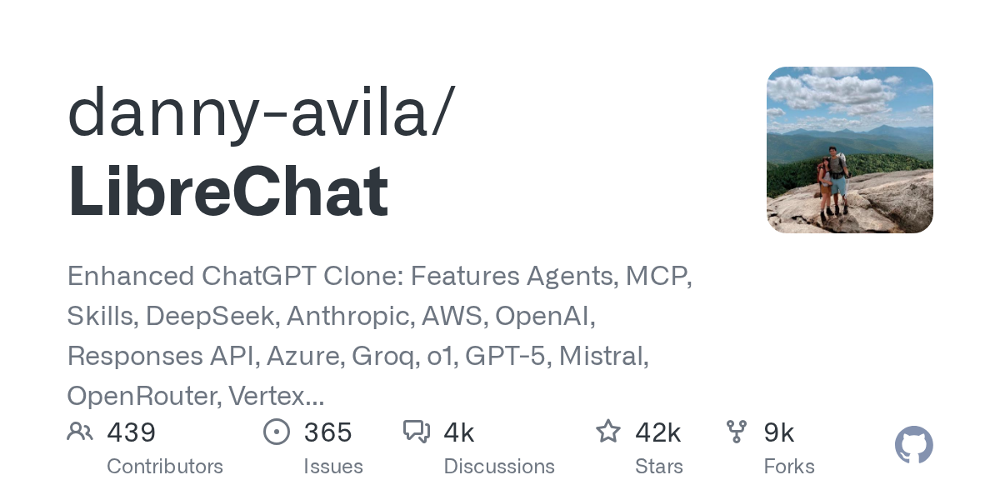

# danny-avila/LibreChat

**⭐ 42 249** · **язык: TypeScript** · **forks: 8 748** · **license: MIT**

> AI · известность · активный push

## Суть

Enhanced ChatGPT Clone: Features Agents, MCP, Skills, DeepSeek, Anthropic, AWS, OpenAI, Responses API, Azure, Groq, o1, GPT-5, Mistral, OpenRouter, Vertex AI, Gemini, Artifacts, AI model switching, message search, Code Interpreter, langchain, DALL-E-3, OpenAPI Actions, Functions, Secure Multi-User Auth, Presets, open-source for self-hosting. Active

## Почему в ленте

- ветка: `imba/ai` (AI)
- score: `144.6`
- источник: `search:ai`
- топики: `ai`, `anthropic`, `artifacts`, `aws`, `azure`, `chatgpt`, `chatgpt-clone`, `claude`

## Из README

  <h1 align="center"> <a href="https://librechat.ai">LibreChat</a> </h1> 
 
 <strong>English</strong> · <a href="README.zh.md">中文</a> 
 

## Ссылки

[Репозиторий](https://github.com/danny-avila/LibreChat) · [сайт](https://librechat.ai/)

---
2026-08-20 · imba-radar
