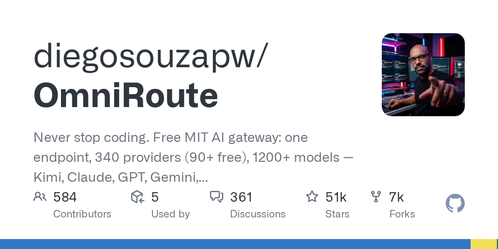

# diegosouzapw/OmniRoute

**⭐ 51 241** · **язык: TypeScript** · **forks: 6 969** · **license: MIT**

> AI · известность · активный push

## Суть

Never stop coding. Free MIT AI gateway: one endpoint, 340 providers (90+ free), 1200+ models — Kimi, Claude, GPT, Gemini, GLM, DeepSeek, MiniMax. Works with Claude Code, Codex, Cursor, OpenCode, Cline & Copilot. Quota-aware auto-fallback, RTK+Caveman compression saves 15-95% tokens, MCP/A2A, Desktop/PWA. Built by 450+ contributors

## Почему в ленте

- ветка: `imba/ai` (AI)
- score: `144.6`
- источник: `search:ai`
- топики: `a2a`, `ai-agents`, `ai-gateway`, `anthropic`, `claude`, `claude-code`, `cline`, `codex`

## Из README

      2026-08-20 · imba-radar
