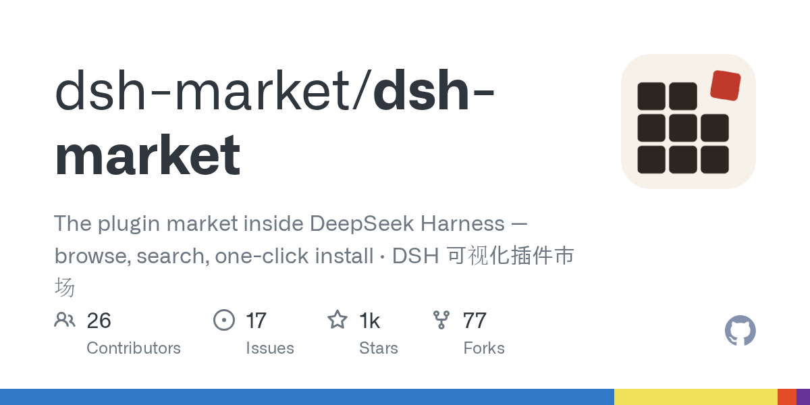

# dsh-market/dsh-market

**⭐ 1 247** · **язык: TypeScript** · **forks: 77** · **license: MIT**

> Tools · известность · активный push

## Суть

The plugin market inside DeepSeek Harness — browse, search, one-click install · DSH 可视化插件市场

## Почему в ленте

- ветка: `imba/tools` (Tools)
- score: `109.0`
- источник: `search:hot`
- топики: `deepseek-harness`, `dsh-plugin`, `marketplace`

## Из README

  
 English | [中文](README.zh.md) > `dsh-market` is independent of any particular client — it works in any host that speaks the standard DeepSeek Harness protocol. We're currently in discussions with `anywhere-labs/deepseek-harness-desktop`…

## Ссылки

[Репозиторий](https://github.com/dsh-market/dsh-market) · [сайт](https://dshmarket.com)

---
2026-08-20 · imba-radar
