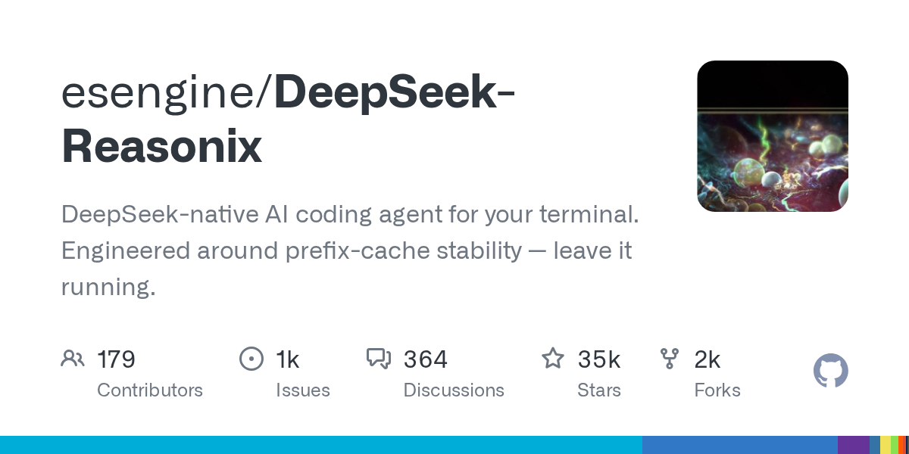

# esengine/DeepSeek-Reasonix

**⭐ 34 875** · **язык: Go** · **forks: 2 314** · **license: MIT**

> AI · известность · активный push

## Суть

DeepSeek-native AI coding agent for your terminal. Engineered around prefix-cache stability — leave it running.

## Почему в ленте

- ветка: `imba/ai` (AI)
- score: `144.6`
- источник: `search:tools`
- топики: `agent`, `agent-framework`, `ai-agent`, `ai-coding`, `cli`, `coding-agent`, `deepseek`, `developer-tools`

## Из README

  
 
 <strong>English</strong> &nbsp;·&nbsp; <a href="./README.zh-CN.md">简体中文</a> &nbsp;·&nbsp; <a href="./docs/GUIDE.md">Guide</a> &nbsp;·&nbsp; <a href="./docs/ACP.md">ACP</a>

## Ссылки

[Репозиторий](https://github.com/esengine/DeepSeek-Reasonix) · [сайт](http://reasonix.io/)

---
2026-08-20 · imba-radar
