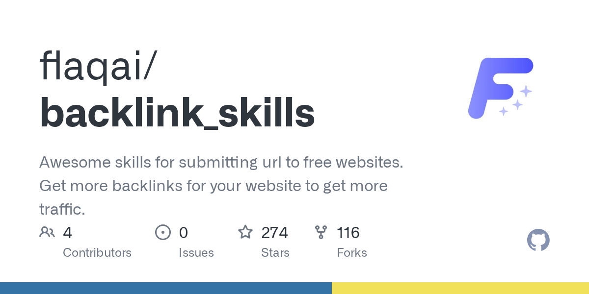

# flaqai/backlink_skills

**⭐ 274** · **язык: Python** · **forks: 116** · **license: MIT**

> AI · известность · свежий репо · активный push

## Суть

Awesome skills for submitting url to free websites. Get more backlinks for your website to get more traffic.

## Почему в ленте

- ветка: `imba/ai` (AI)
- score: `98.5`
- источник: `search:hot`
- топики: `backlinks`, `codex`, `codex-skill`, `free-backlinks`, `freebacklinks`, `seo`, `seo-optimization`, `seo-skills`

## Из README

> 这是 Flaq AI 团队在实际产品推广过程中整理并持续维护的一套开源工作流，包含外链渠道清单、两种产品目录提交 Skill、通用 SEO 写作 Skill，以及面向 LinkedIn、Medium 和微信公众号的定制写作 Skill。 这个项目不是“一键群发外链”工具，也不承诺收录、Dofollow、流量或排名。我们希望分享的是一套更可复用的做法：让 Codex 先检查渠道，再按授权执行，遇到验证码时交给用户，提交后保留证据；需要内容时，再根据发布平台生成适合当地读者和规则的文章，而不是把同一篇 SEO 文案复制到所有网站。 **语言：** [简体中文（主文档）](README.md) · [English](README_e…

## Ссылки

[Репозиторий](https://github.com/flaqai/backlink_skills) · [сайт](https://flaq.ai/openai-codex-guide/)

---
2026-08-20 · imba-radar
