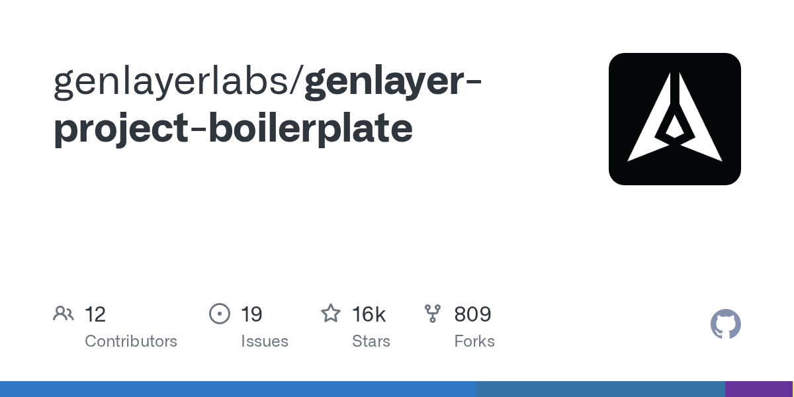

# genlayerlabs/genlayer-project-boilerplate

**⭐ 16 225** · **язык: TypeScript** · **forks: 809** · **license: MIT**

> Hot · известность

## Суть

Без описания

## Почему в ленте

- ветка: `imba/hot` (Hot)
- score: `117.6`
- источник: `trending:typescript`
- топики: _нет_

## Из README

This project includes the boilerplate code for a GenLayer use case implementation, specifically a football bets game. - An example intelligent contract (Football Bets) with web access and LLM integration - **Direct mode tests** — fast, in-memory unit tests with web/LLM mocking (~ms per test)

## Ссылки

[Репозиторий](https://github.com/genlayerlabs/genlayer-project-boilerplate)

---
2026-08-20 · imba-radar
