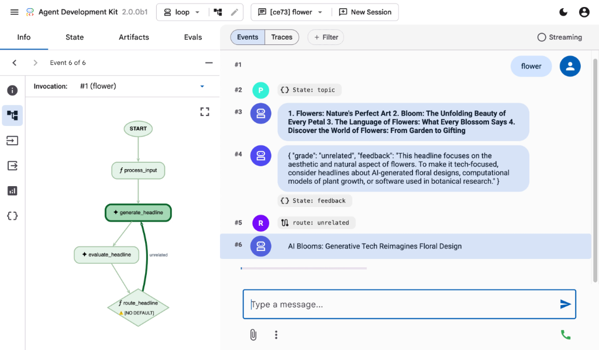

# google/adk-python

**⭐ 21 194** · **язык: Python** · **forks: 3 866** · **license: Apache-2.0**

> AI · известность · активный push

## Суть

An open-source, code-first Python toolkit for building, evaluating, and deploying sophisticated AI agents with flexibility and control.

## Почему в ленте

- ветка: `imba/ai` (AI)
- score: `144.6`
- источник: `search:ai`
- топики: `agent`, `agentic`, `agentic-ai`, `agents`, `agents-sdk`, `ai`, `ai-agents`, `aiagentframework`

## Из README

 <h2 align="center"> 

## Ссылки

[Репозиторий](https://github.com/google/adk-python) · [сайт](https://google.github.io/adk-docs/)

---
2026-08-20 · imba-radar
