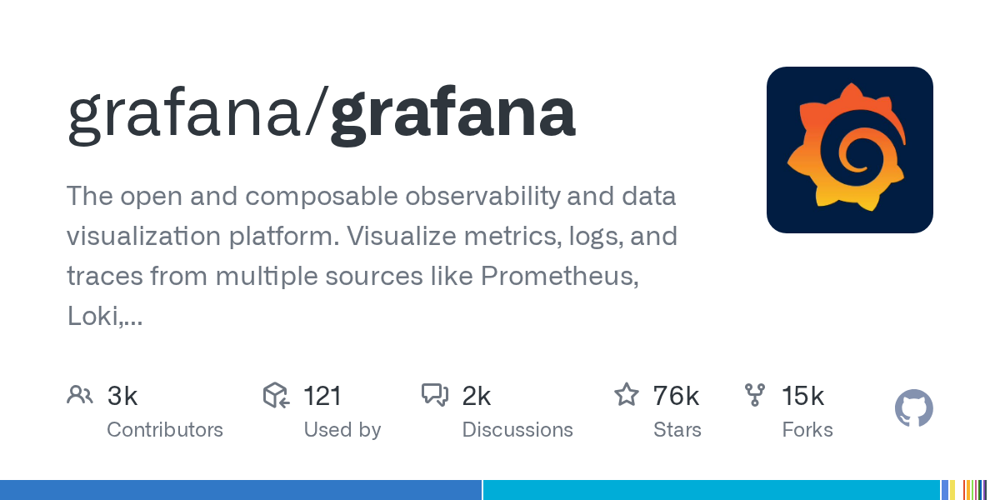

# grafana/grafana

**⭐ 76 316** · **язык: TypeScript** · **forks: 14 588** · **license: AGPL-3.0**

> Hot · известность · активный push

## Суть

The open and composable observability and data visualization platform. Visualize metrics, logs, and traces from multiple sources like Prometheus, Loki, Elasticsearch, InfluxDB, Postgres and many more.

## Почему в ленте

- ветка: `imba/hot` (Hot)
- score: `144.6`
- источник: `trending:typescript`
- топики: `alerting`, `analytics`, `business-intelligence`, `dashboard`, `data-visualization`, `elasticsearch`, `go`, `grafana`

## Из README

The open-source platform for monitoring and observability Grafana allows you to query, visualize, alert on and understand your metrics no matter where they are stored. Create, explore, and share dashboards with your team and foster a data-driven culture: - **Visualizations:** Fast and flexible client side graphs with a…

## Ссылки

[Репозиторий](https://github.com/grafana/grafana) · [сайт](https://grafana.com)

---
2026-08-20 · imba-radar
