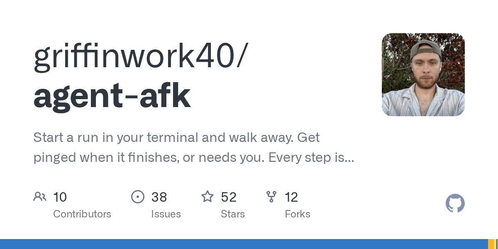

# griffinwork40/agent-afk

**⭐ 52** · **язык: TypeScript** · **forks: 12** · **license: Apache-2.0**

> AI · активный push

## Суть

Start a run in your terminal and walk away. Get pinged when it finishes, or needs you. Every step is a readable trace you check before anything ships.

## Почему в ленте

- ветка: `imba/ai` (AI)
- score: `56.0`
- источник: `search:bots`
- топики: `afk`, `agent-framework`, `agents`, `ai`, `anthropic`, `autonomous-agent`, `claude`, `claude-code`

## Из README

> **Claude Code decides how the agent behaves. Agent AFK lets you edit the rules.** **Agent AFK** is an open-source coding-agent harness you can actually change. Run long coding tasks while you're away, use any model, and edit the rules that decide what the agent can touch, when it stops, and how it proves the work.

## Ссылки

[Репозиторий](https://github.com/griffinwork40/agent-afk) · [сайт](https://docs.agentafk.com)

---
2026-08-20 · imba-radar
