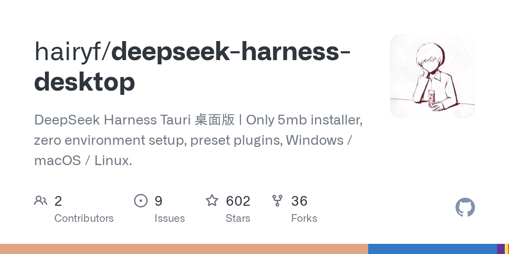

# hairyf/deepseek-harness-desktop

**⭐ 602** · **язык: Rust** · **forks: 36** · **license: MIT**

> New · известность · активный push

## Суть

DeepSeek Harness Tauri 桌面版 | Only 5mb installer, zero environment setup, preset plugins, Windows / macOS / Linux.

## Почему в ленте

- ветка: `imba/new` (New)
- score: `93.2`
- источник: `search:hot`
- топики: `deepseek`, `deepseek-harness`, `desktop`, `dsh`, `dsh-plugin`, `tauri`

## Из README

  
 <h1 align="center">DeepSeek Harness 桌面版</h1> 
 在桌面上一键运行 <a href="https://github.com/deepseek-ai/deepseek-harness">DeepSeek Harness</a> ——…

## Ссылки

[Репозиторий](https://github.com/hairyf/deepseek-harness-desktop)

---
2026-08-20 · imba-radar
