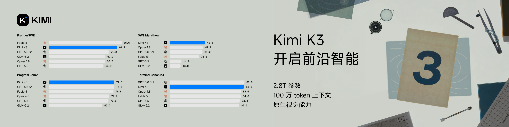

# harry0703/MoneyPrinterTurbo

**⭐ 110 650** · **язык: Python** · **forks: 16 786** · **license: MIT**

> AI · известность · активный push

## Суть

利用 AI 大模型和自动化工作流，根据主题或关键词一键生成高清短视频。Generate HD short videos from a topic or keyword with an automated AI workflow.

## Почему в ленте

- ветка: `imba/ai` (AI)
- score: `141.6`
- источник: `trending:python`
- топики: `ai-video-generator`, `content-creation`, `ffmpeg`, `instagram-reels`, `llm`, `python`, `short-video`, `subtitles`

## Из README

 只需提供视频<b>主题</b>或<b>关键词</b>，即可自动生成视频脚本、匹配素材、生成字幕和背景音乐，并合成高清短视频。 <a href="https://trendshift.io/repositories/8731" target="_blank">2026-08-20 · imba-radar
