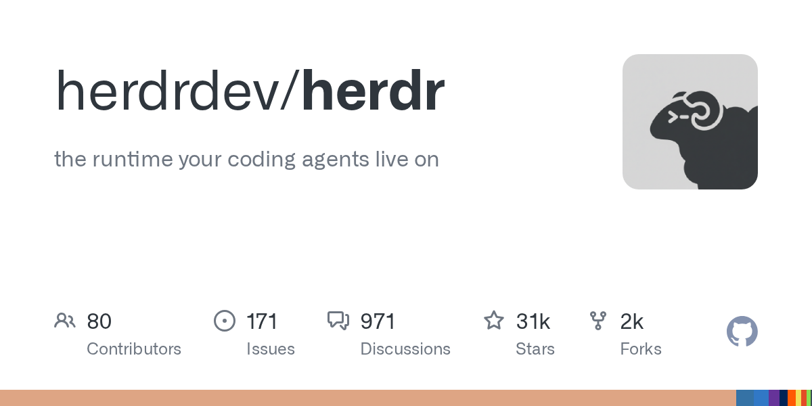

# herdrdev/herdr

**⭐ 30 663** · **язык: Rust** · **forks: 2 191** · **license: Apache-2.0**

> Tools · известность · активный push

## Суть

the runtime your coding agents live on

## Почему в ленте

- ветка: `imba/tools` (Tools)
- score: `144.6`
- источник: `search:tools`
- топики: `agent`, `agent-orchestration`, `ai`, `ai-agents`, `claude-code`, `cli`, `codex`, `coding-agents`

## Из README

  
 
 <a href="https://herdr.dev">herdr.dev</a> · <a href="#install">install</a> · <a href="https://herdr.dev/docs/quick-start/">quick start</a> · <a href="https://herdr.dev/docs/">docs</a> 

## Ссылки

[Репозиторий](https://github.com/herdrdev/herdr) · [сайт](https://herdr.dev)

---
2026-08-20 · imba-radar
