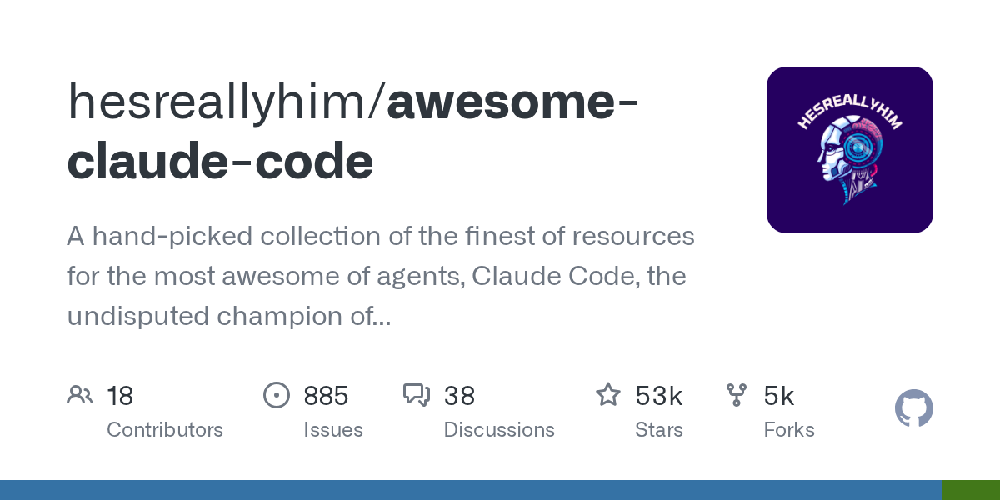

# hesreallyhim/awesome-claude-code

**⭐ 52 655** · **язык: Python** · **forks: 4 599** · **license: NOASSERTION**

> AI · известность · активный push

## Суть

A hand-picked collection of the finest of resources for the most awesome of agents, Claude Code, the undisputed champion of coding companions, from the unstoppable team at Anthropic PBC. A delectable showcase of top tier skills, ambidextrous agents, scintillating status lines, top notch developer tooling, and also we have plugins

## Почему в ленте

- ветка: `imba/ai` (AI)
- score: `137.6`
- источник: `search:ai`
- топики: `agent-skills`, `agentic-code`, `agentic-coding`, `ai-workflow-optimization`, `ai-workflows`, `anthropic`, `anthropic-claude`, `awesome`

## Из README

<!-- Awesome Claude Code --> _A hand-picked collection of the finest of resources for the most awesome of agents, [Claude Code](https://code.claude.com/docs/), the undisputed champion of coding companions, from the unstoppable team at [Anthropic PBC](https://github.com/anthropics/claude-code). A delectable showcase of…

## Ссылки

[Репозиторий](https://github.com/hesreallyhim/awesome-claude-code)

---
2026-08-20 · imba-radar
