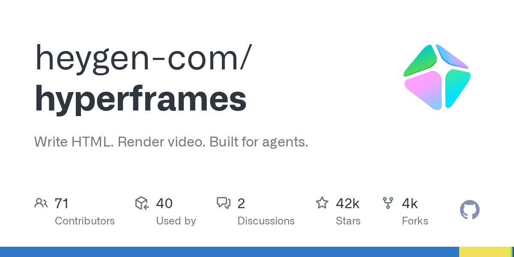

# heygen-com/hyperframes

**⭐ 41 710** · **язык: TypeScript** · **forks: 4 002** · **license: Apache-2.0**

> AI · известность · активный push

## Суть

Write HTML. Render video. Built for agents.

## Почему в ленте

- ветка: `imba/ai` (AI)
- score: `141.6`
- источник: `search:ai`
- топики: `ai`, `animation`, `ffmpeg`, `framework`, `gsap`, `html`, `mcp`, `puppeteer`

## Из README

 <picture> <source media="(prefers-color-scheme: dark)" srcset="docs/logo/dark.svg"> <source media="(prefers-color-scheme: light)" srcset="docs/logo/light.svg">  </picture> 
 
 <a href="https://www.npmjs.com/package/hyper…

## Ссылки

[Репозиторий](https://github.com/heygen-com/hyperframes)

---
2026-08-20 · imba-radar
