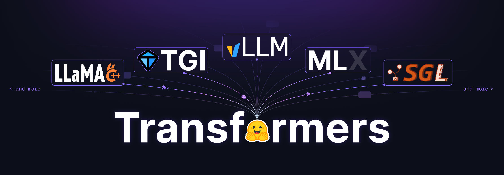

# huggingface/transformers

**⭐ 164 268** · **язык: Python** · **forks: 34 293** · **license: Apache-2.0**

> AI · известность · активный push

## Суть

🤗 Transformers: the model-definition framework for state-of-the-art machine learning models in text, vision, audio, and multimodal models, for both inference and training.

## Почему в ленте

- ветка: `imba/ai` (AI)
- score: `144.6`
- источник: `search:ai`
- топики: `audio`, `deep-learning`, `deepseek`, `gemma`, `glm`, `hacktoberfest`, `llm`, `machine-learning`

## Из README

<!--- Copyright 2020 The HuggingFace Team. All rights reserved. Licensed under the Apache License, Version 2.0 (the "License"); you may not use this file except in compliance with the License. You may obtain a copy of the License at http://www.apache.org/licenses/LICENSE-2.0 Unless required by applicable law or agreed…

## Ссылки

[Репозиторий](https://github.com/huggingface/transformers) · [сайт](https://huggingface.co/transformers)

---
2026-08-20 · imba-radar
