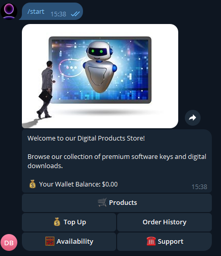

# indmdev/Free-Telegram-Store-Bot

**⭐ 153** · **язык: Python** · **forks: 91** · **license: MIT**

> Bots · известность · активный push

## Суть

This is 100% Free Shop Bot, Is a Telegram Store Bot you can use for selling your products and services and managing your products and orders. You customers can  easily use the Auto Buy Bot  to shop on you store with confidence using this Auto shop bot.

## Почему в ленте

- ветка: `imba/bots` (Bots)
- score: `64.2`
- источник: `search:bots`
- топики: `autobot`, `cryptobot`, `digital-products`, `e-commerce`, `e-commerce-bot`, `free`, `free-bot-for-crypto-trading`, `free-script`

## Из README

I made this Bot Free 100%. > Message me at [@InDMDev](https://t.me/InDMDev) for your advanced bot customizations. > For more Bots like this, and to be the first to know when I publish more advanced bots, join my channel: [@InDMDevBots](https://t.me/InDMDevBots) Telegram bot for selling digital products: · sell software…

## Ссылки

[Репозиторий](https://github.com/indmdev/Free-Telegram-Store-Bot) · [сайт](https://indmdev.com)

---
2026-08-20 · imba-radar
