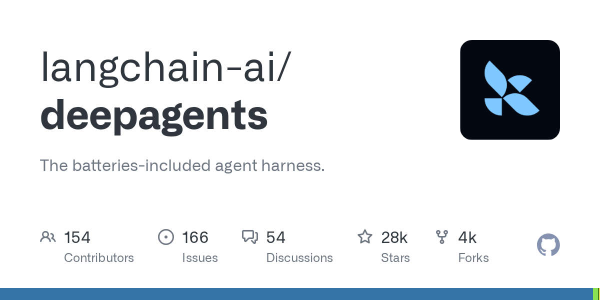

# langchain-ai/deepagents

**⭐ 27 949** · **язык: Python** · **forks: 3 904** · **license: MIT**

> AI · известность · активный push

## Суть

The batteries-included agent harness.

## Почему в ленте

- ветка: `imba/ai` (AI)
- score: `144.6`
- источник: `search:ai`
- топики: `ai`, `deepagents`, `langchain`, `langgraph`, `python`, `typescript`

## Из README

 <a href="https://docs.langchain.com/oss/python/deepagents/overview#deep-agents-overview"> <picture> <source media="(prefers-color-scheme: dark)" srcset=".github/images/logo-dark.svg"> <source media="(prefers-color-scheme: light)" srcset=".github/images/logo-light.svg">

## Ссылки

[Репозиторий](https://github.com/langchain-ai/deepagents) · [сайт](https://docs.langchain.com/deepagents)

---
2026-08-20 · imba-radar
