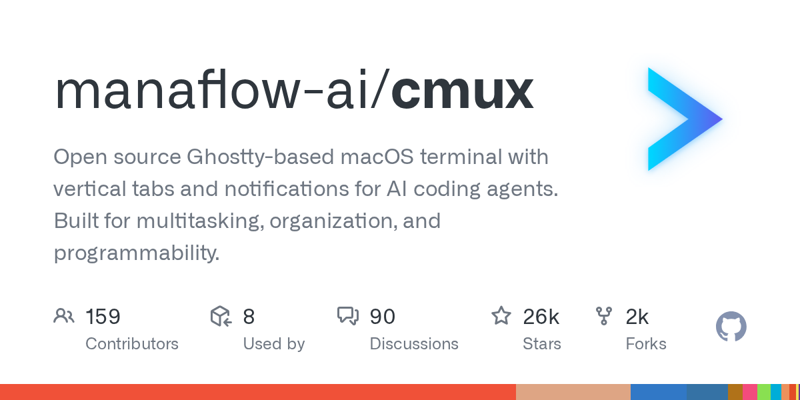

# manaflow-ai/cmux

**⭐ 26 251** · **язык: Swift** · **forks: 2 239** · **license: NOASSERTION**

> Tools · известность · активный push

## Суть

Open source Ghostty-based macOS terminal with vertical tabs and notifications for AI coding agents. Built for multitasking, organization, and programmability.

## Почему в ленте

- ветка: `imba/tools` (Tools)
- score: `140.6`
- источник: `search:tools`
- топики: `amp`, `claude-code`, `cli`, `codex`, `coding-agents`, `gemini`, `ghostty`, `macos`

## Из README

<h1 align="center">cmux</h1> 
A Ghostty-based macOS terminal with vertical tabs and notifications for AI coding agents
 
 <a href="https://github.com/manaflow-ai/cmux/releases/latest/download/cmux-macos.dmg"> 2026-08-20 · imba-radar
