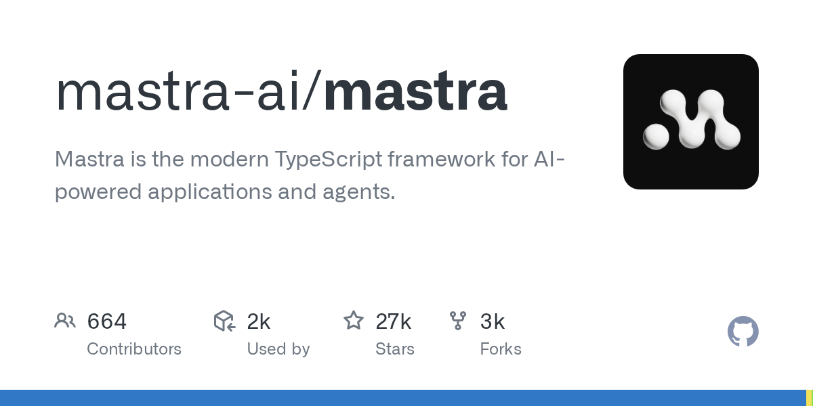

# mastra-ai/mastra

**⭐ 27 313** · **язык: TypeScript** · **forks: 2 660** · **license: NOASSERTION**

> AI · известность · активный push

## Суть

Mastra is the modern TypeScript framework for AI-powered applications and agents.

## Почему в ленте

- ветка: `imba/ai` (AI)
- score: `140.6`
- источник: `search:ai`
- топики: `agents`, `ai`, `chatbots`, `evals`, `javascript`, `llm`, `mcp`, `nextjs`

## Из README

Mastra is a framework for building AI-powered applications and agents with a modern TypeScript stack. It includes everything you need to go from early prototypes to production-ready applications. Mastra integrates with frontend and backend frameworks like React, Next.js, and Node, or you can deploy it anywhere as a sta…

## Ссылки

[Репозиторий](https://github.com/mastra-ai/mastra) · [сайт](https://mastra.ai)

---
2026-08-20 · imba-radar
