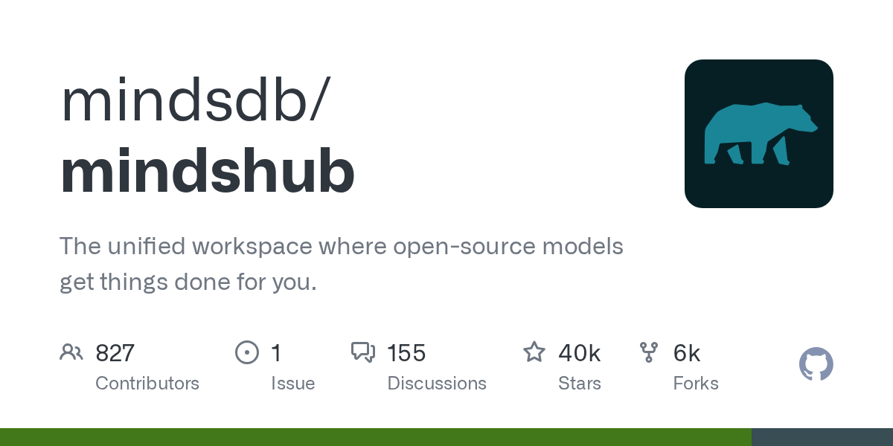

# mindsdb/mindshub

**⭐ 39 611** · **язык: Makefile** · **forks: 6 230** · **license: MIT**

> AI · известность · активный push

## Суть

The unified workspace where open-source models get things done for you.

## Почему в ленте

- ветка: `imba/ai` (AI)
- score: `144.6`
- источник: `search:ai`
- топики: `agents`, `ai`, `anton`, `artificial-inteligence`, `claude`, `claude-cowork`, `codex`, `cowork`

## Из README

 
 **The unified workspace where open-source models get things done for you.** _Make AI do actual work. Swap the model anytime — keep everything you've built._ [Website](https://mindshub.ai/?utm_source=github&utm_medium=repo-readme&utm_campaign=minds-readme) ·

## Ссылки

[Репозиторий](https://github.com/mindsdb/mindshub) · [сайт](https://mindshub.ai)

---
2026-08-20 · imba-radar
