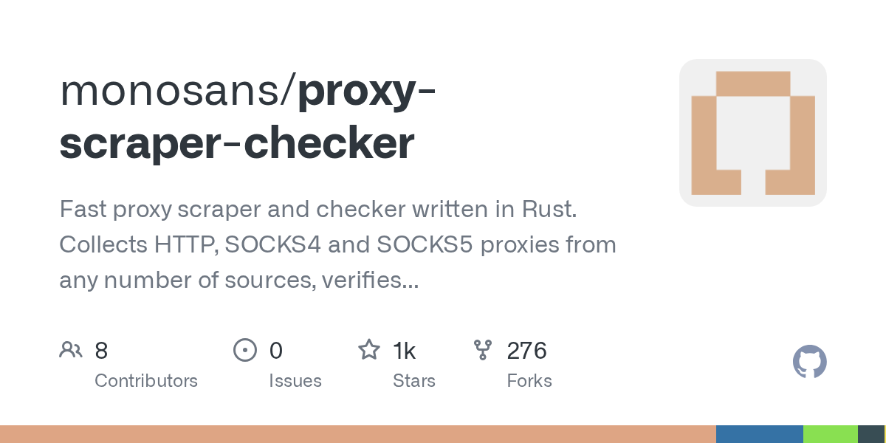

# monosans/proxy-scraper-checker

**⭐ 1 315** · **язык: Rust** · **forks: 276** · **license: MIT**

> Tools · известность · активный push

## Суть

Fast proxy scraper and checker written in Rust. Collects HTTP, SOCKS4 and SOCKS5 proxies from any number of sources, verifies each one really works, and writes JSON and plain text with response time, exit IP, ASN and geolocation. Single binary for Windows, Linux, macOS and Android, with an interactive TUI.

## Почему в ленте

- ветка: `imba/tools` (Tools)
- score: `95.7`
- источник: `search:tools`
- топики: `async`, `cli`, `free-proxy`, `geolocation`, `http-proxy`, `proxy`, `proxy-checker`, `proxy-grabber`

## Из README

A proxy scraper and checker written in Rust. It collects HTTP/SOCKS4/SOCKS5 proxies from any number of sources, verifies each one really works, and writes the survivors out with response times, geolocation and network ownership attached. - Async Rust, shipped as a single binary for Windows, Linux, macOS and Android. No…

## Ссылки

[Репозиторий](https://github.com/monosans/proxy-scraper-checker)

---
2026-08-20 · imba-radar
