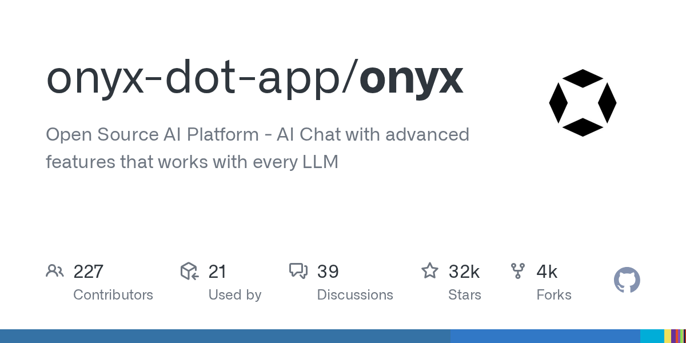

# onyx-dot-app/onyx

**⭐ 31 675** · **язык: Python** · **forks: 4 366** · **license: NOASSERTION**

> AI · известность · активный push

## Суть

Open Source AI Platform - AI Chat with advanced features that works with every LLM

## Почему в ленте

- ветка: `imba/ai` (AI)
- score: `140.6`
- источник: `search:ai`
- топики: `ai`, `ai-chat`, `chatgpt`, `chatui`, `enterprise-search`, `gen-ai`, `information-retrieval`, `llm`

## Из README

 <h2 align="center">  </h2> 
 <a href="https://discord.gg/TDJ59cGV2X" target="_bl…

## Ссылки

[Репозиторий](https://github.com/onyx-dot-app/onyx) · [сайт](https://onyx.app)

---
2026-08-20 · imba-radar
