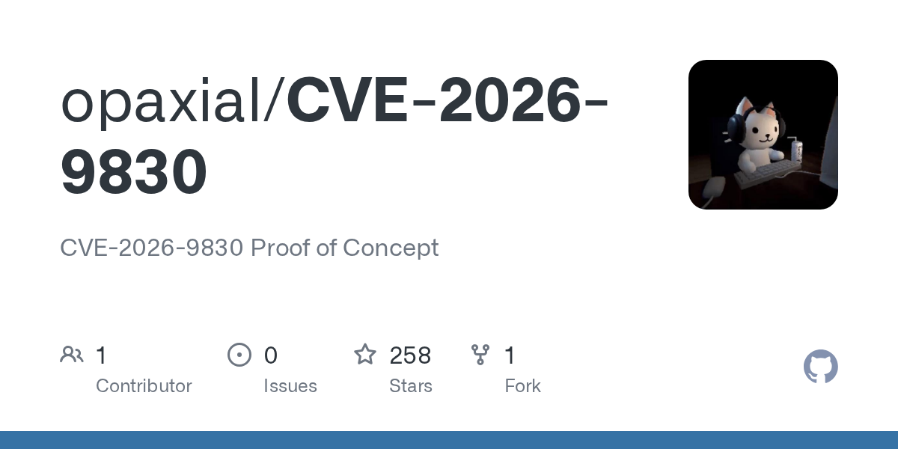

# opaxial/CVE-2026-9830

**⭐ 258** · **язык: Python** · **forks: 1** · **license: Apache-2.0**

> New · известность

## Суть

CVE-2026-9830 Proof of Concept

## Почему в ленте

- ветка: `imba/new` (New)
- score: `70.8`
- источник: `search:hot`
- топики: `cve`, `cve-2026-9830`, `cvss`, `exploit`, `exploit-db`, `latest`, `poc`, `proof-of-concept`

## Из README

This repository contains a Python proof of concept for validating a reported unauthenticated BookingPress Pro REST API exposure. A successful response may contain booking and customer information, which can include personal data. Use this project only against systems you own or are explicitly authorized to assess. Do n…

## Ссылки

[Репозиторий](https://github.com/opaxial/CVE-2026-9830)

---
2026-08-20 · imba-radar
